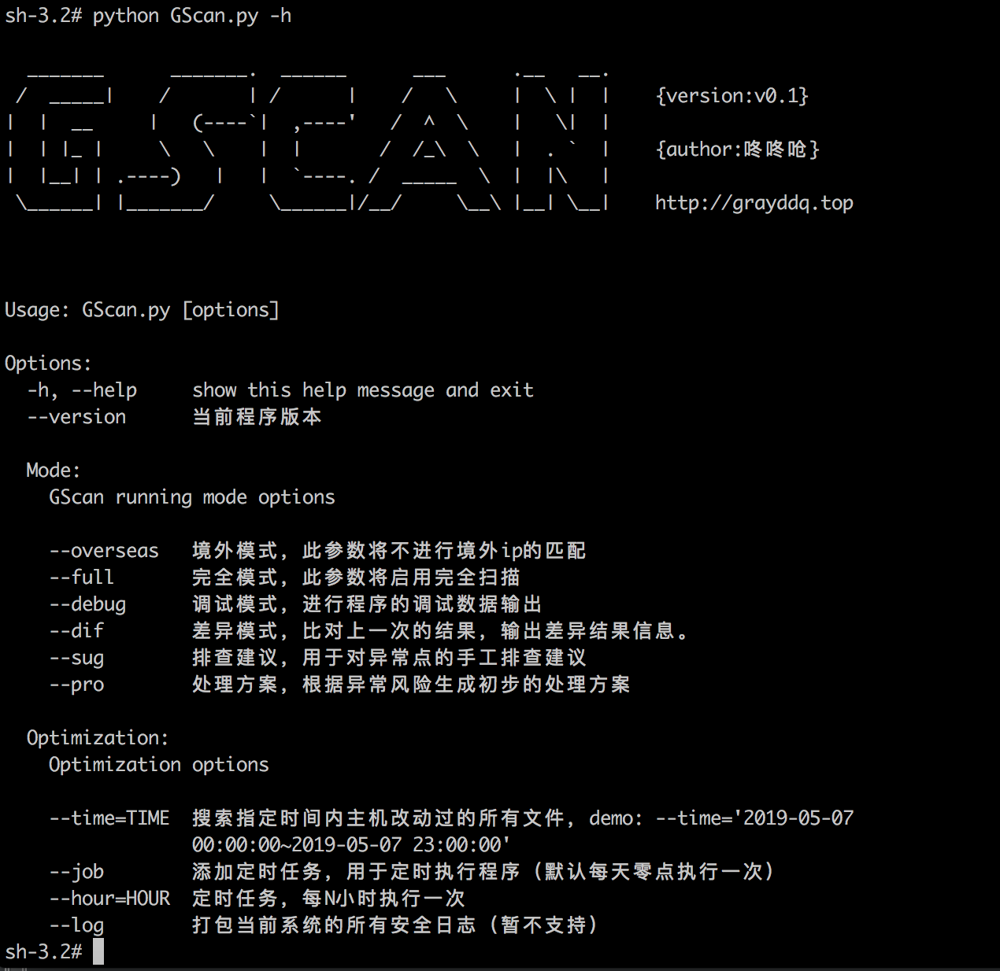
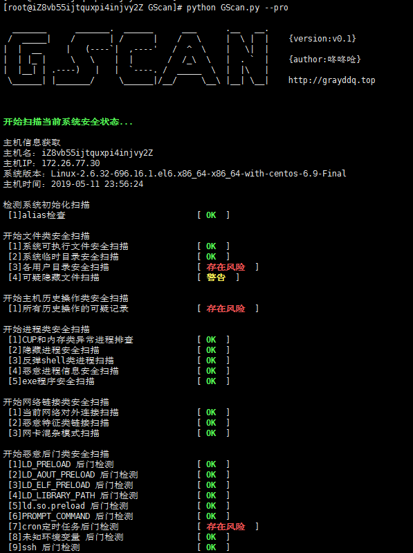
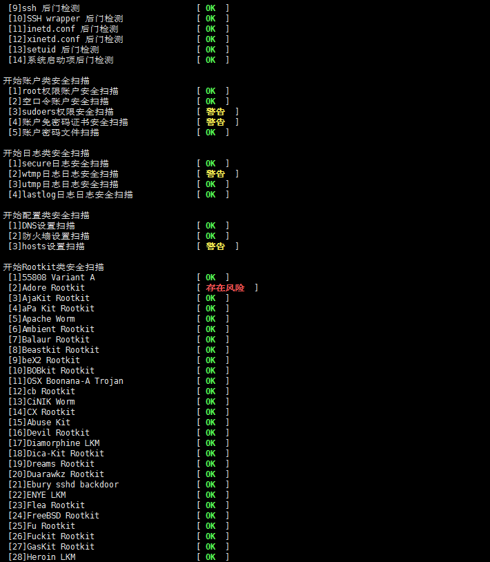

# GScan v0.1

本程序旨在为安全应急响应人员对Linux主机排查时提供便利，实现主机侧Checklist的自动全面化检测，尽可能的发现入侵痕迹，包括但不限于进程、历史操作、恶意文件、后门rootkit等方式。

## 作者 ##

咚咚呛 

如有其他建议，可联系微信280495355

## CheckList检测项 ##

自动化程序的CheckList项如下：

	1、主机信息获取
	2、文件类安全扫描
	  2.1、系统可执行文件安全扫描
	  2.2、临时目录文件安全扫描
	  2.3、用户目录文件扫描
	  2.4、可疑隐藏文件扫描
	3、各用户历史操作类
	  3.1、境外ip操作类
	  3.2、反弹shell执行类
	4、进程类安全检测
	  4.1、CUP和内存使用异常进程排查
	  4.2、隐藏进程安全扫描
	  4.3、反弹shell类进程扫描
	  4.4、恶意名进程安全扫描
	  4.5、进程对应可执行文件安全扫描
	5、网络类安全检测
	  5.1、境外IP链接扫描
	  5.3、恶意特征链接扫描
	  5.4、网卡混杂模式检测
	6、后门类检测
	  6.1、LD_PRELOAD后门检测
	  6.2、LD_AOUT_PRELOAD后门检测
	  6.3、LD_ELF_PRELOAD后门检测
	  6.4、LD_LIBRARY_PATH后门检测
	  6.5、ld.so.preload后门检测
	  6.6、PROMPT_COMMAND后门检测
	  6.7、Crontab后门检测
	  6.8、Alias后门
	  6.9、SSH 后门检测
	  6.10、SSH wrapper 后门检测
	  6.11、inetd.conf 后门检测
	  6.12、xinetd.conf 后门检测
	  6.13、8种系统启动项后门检测
	7、账户类安全排查
	  7.1、root权限账户检测
	  7.2、空口令账户检测
	  7.3、sudoers文件用户权限检测
	  7.4、查看各账户下登录公钥
	8、日志类安全分析
	  8.1、secure登陆日志
	  8.2、wtmp登陆日志
	  8.3、utmp登陆日志
	  8.4、lastlog登陆日志
	9、安全配置类分析
	  9.1、DNS配置检测
	  9.2、Iptables防火墙配置检测
	  9.3、hosts配置检测
	10、Rootkit分析
	  10.1、检查已知rootkit文件类特征
	  10.2、检查已知rootkit LKM类特征
	  10.3、检查已知恶意软件类特征检测
	11.WebShell类文件扫描
	  11.1、WebShell类文件扫描
	  
	  

## 测试环境 ##

>系统：CentOS (6、7) + python (2.x、3.x)
>
>注：目前程序只针对Centos进行开发测试，程序执行需要root权限，其他系统并未做兼容性，检测结果未知

## 部署和执行 ##
> root# <kbd>git clone https://github.com/grayddq/GScan.git</kbd>
>
> root# <kbd>cd GScan</kbd>
> 
> root# <kbd>sudo python GScan.py</kbd>

## 程序脚本说明 ##

	GScan
	----GScan.py                #主程序
	----lib                     #模块库文件
	-------common.py            #调用的公共库
	-------Host_Info.py         #主机信息获取
	-------File_Analysis.py     #文件类安全检测
	-------History_Analysis.py  #用户历史操作类
	-------Proc_Analysis.py     #进程类安全检测
	-------Network_Analysis.py  #网络类安全检测
	-------Backdoor_Analysis.py #后门类检测
	-------User_Analysis.py     #账户类安全排查
	-------Log_Analysis.py      #日志类安全分析
	-------Config_Analysis.py   #安全配置类分析
	-------Rootkit_Analysis.py  #Rootkit分析
	-------SSHAnalysis.py       #secure日志分析
	-------Webserver.py         #获取当前web服务的web根目录
	-------Webshell_Analysis.py #webshell检测
	-----ip                     #ip地址定位库
	-----malware                #各类恶意特征库
	-----egg                    #yara打包动态库
	-----webshell_rule        #webshell检测的规则

## 程序特点 ##

>1、程序检测的逻辑和方法，均是由一线安全应急人员根据多年实战经验总结出来的。
>
>2、程序包括10W+的恶意特征信息，用于恶意文件的比对和查杀。
>
>3、WebShell的检测采用目前比较流行的Yara库进行查杀。

## 程序对标 ##

>入侵痕迹的检测按照经验归纳为如下子项，省去了一些安全配置和基线类等无关项。
>
>注：对比内容为程序的实际检测输出结果，其仅代表个人的观点，不代表产品说明。

    GScan      程序定位为安全人员提供的一项入侵检测工具，旨在尽可能的发现入侵痕迹，包括历史操作、恶意文件、后门rootkit等不同的方式。
	chkrootkit 程序定位为安全人员提供的一项入侵检测工具，旨在发现被植入的后门或者rootkit。
	rkhunter   程序定位为安全人员提供的一项入侵检测工具，旨在发现被植入的后门或者rootkit。
	lynis      程序定位为安全人员日常使用的一款用于主机基线和审计的工具，可辅助漏洞扫描和配置管理，也可部分用于入侵检测。

| 检测项 |  GScan  | chkrootkit | rkhunter |  lynis  |
|:-------------|:---------: |:------: |:------: |:---------: |
| 对比版本 | v0.1 | v0.53 | v1.4.6 | v2.7.1 |
| 【检测前检查项】文件alias检查 | x | √ | x | x |
| 【检测前检查项】系统重要文件完整性检测 | x | √ | x | x |
| 【主机文件检测】系统重要文件权限检测 | x | √ | √ | x |
| 【主机文件检测】文件恶意特征扫描 | √ | x | x | x |
| 【主机文件检测】文件境外IP特征扫描 | √ | x | x | x |
| 【主机文件检测】敏感目录mount隐藏检测 | x | x | √ | √ |
| 【主机操作检测】境外IP操作记录检测 | √ | x | x | x |
| 【主机操作检测】可疑操作或异常检测 | x | √ | x | x |
| 【主机进程检测】CPU&内存使用异常检测 | √ | x | x | √ |
| 【主机进程检测】I/O异常检测 | x | x | x | √ |
| 【主机进程检测】隐藏进程检测 | √ | x | √ | x |
| 【主机进程检测】反弹shell进程检测 | √ | x | x | x |
| 【主机进程检测】可疑进程名称检测 | √ | x | x | x |
| 【主机进程检测】进程exe恶意特征检测 | √ | x | x | x |
| 【主机进程检测】僵尸进程检测 | x | x | x | √ |
| 【主机进程检测】可疑的较大共享内存检测 | x | x | √ | x |
| 【主机进程检测】内存恶意特征检测 | x | x | x | x |
| 【网络链接检测】境外IP链接检测 | √ | x | x | x |
| 【网络链接检测】恶意特征链接检测 | √ | √ | √ | x |
| 【网络链接检测】网卡混杂模式检测 | √ | √ | √ | √ |
| 【常规后门检测】LD_PRELOAD后门检测 | √ | x | √ | x |
| 【常规后门检测】LD_AOUT_PRELOAD后门检测 | √ | x | √ | x |
| 【常规后门检测】LD_ELF_PRELOAD后门检测 | √ | x | √ | x |
| 【常规后门检测】LD_LIBRARY_PATH后门检测 | √ | x | √ | x |
| 【常规后门检测】ld.so.preload后门检测 | √ | x | √ | x |
| 【常规后门检测】PROMPT_COMMAND后门检测 | √ | x | x | x |
| 【常规后门检测】Crontab后门检测 | √ | x | x | x |
| 【常规后门检测】alias后门检测 | √ | x | √ | x |
| 【常规后门检测】SSH后门检测 | √ | x | x | x |
| 【常规后门检测】SSH Wrapper后门检测 | √ | x | x | x |
| 【常规后门检测】inetd.conf后门检测 | √ | x | √ | x |
| 【常规后门检测】xinetd.conf后门检测 | √ | x | √ | x |
| 【常规后门检测】系统启动项(/etc/init.d/)后门检测 | √ | x | √ | x |
| 【常规后门检测】系统启动项(/etc/rc.d/)后门检测 | √ | x | √ | x |
| 【常规后门检测】系统启动项(/etc/rc.local)后门检测 | √ | x | √ | x |
| 【常规后门检测】系统启动项(/usr/local/etc/rc.d)后门检测 | √ | x | √ | x |
| 【常规后门检测】系统启动项(/usr/local/etc/rc.local)后门检测 | √ | x | √ | x |
| 【常规后门检测】系统启动项(/etc/conf.d/local.start)后门检测 | √ | x | √ | x |
| 【常规后门检测】系统启动项(/etc/inittab)后门检测 | √ | x | √ | x |
| 【常规后门检测】系统启动项(/etc/systemd/system)后门检测 | √ | x | √ | x |
| 【账户安全检测】root权限账户检测 | √ | x | √ | √ |
| 【账户安全检测】空口令账户检测 | √ | x | √ | √ |
| 【账户安全检测】sudoers文件检测 | √ | x | x | √ |
| 【账户安全检测】用户组文件检测 | x | x | √ | √ |
| 【账户安全检测】密码文件检测 | x | x | √ | √ |
| 【账户安全检测】用户免密登录公钥检测 | √ | x | √ | x |
| 【日志安全检测】secure日志安全检测 | √ | x | x | x |
| 【日志安全检测】wtmp日志安全检测 | √ | √ | x | x |
| 【日志安全检测】utmp日志安全检测 | √ | √ | x | x |
| 【日志安全检测】lastlog日志安全检测 | √ | √ | x | x |
| 【安全配置检测】DNS设置检测 | √ | x | x | √ |
| 【安全配置检测】防火墙设置检测 | √ | x | x | √ |
| 【安全配置检测】hosts安全检测 | √ | x | x | √ |
| 【Rootkit检测】已知Rootkit文件特征检测 | √ | √ | √ | x |
| 【Rootkit检测】已知Rootkit LKM类特征检测 | √ | √ | √ | x |
| 【Rootkit检测】恶意软件类特征检测 | √ | x | √ | x |
| 【WEBShell检测】Nginx服务WebShell检测 | √ | x | x | x |
| 【WEBShell检测】Apache服务WebShell检测 | √ | x | x | x |
| 【WEBShell检测】Tomcat服务WebShell检测 | √ | x | x | x |
| 【WEBShell检测】Jetty服务WebShell检测 | √ | x | x | x |
| 【WEBShell检测】Resin服务WebShell检测 | √ | x | x | x |
| 【WEBShell检测】Jenkins服务WebShell检测 | √ | x | x | x |
| 【WEBShell检测】其他默认web目录WebShell检测 | √ | x | x | x |
| 【漏洞类检查】服务漏洞或配置错误检查 | x | x | x | √ |

## 检测结果 ##

日志及结果目录默认：/var/log/gscan/gscan.log

## 运行截图 ##

## 参考链接 ##
http://www.chkrootkit.org
https://github.com/CISOfy/lynis
http://rkhunter.sourceforge.net/

